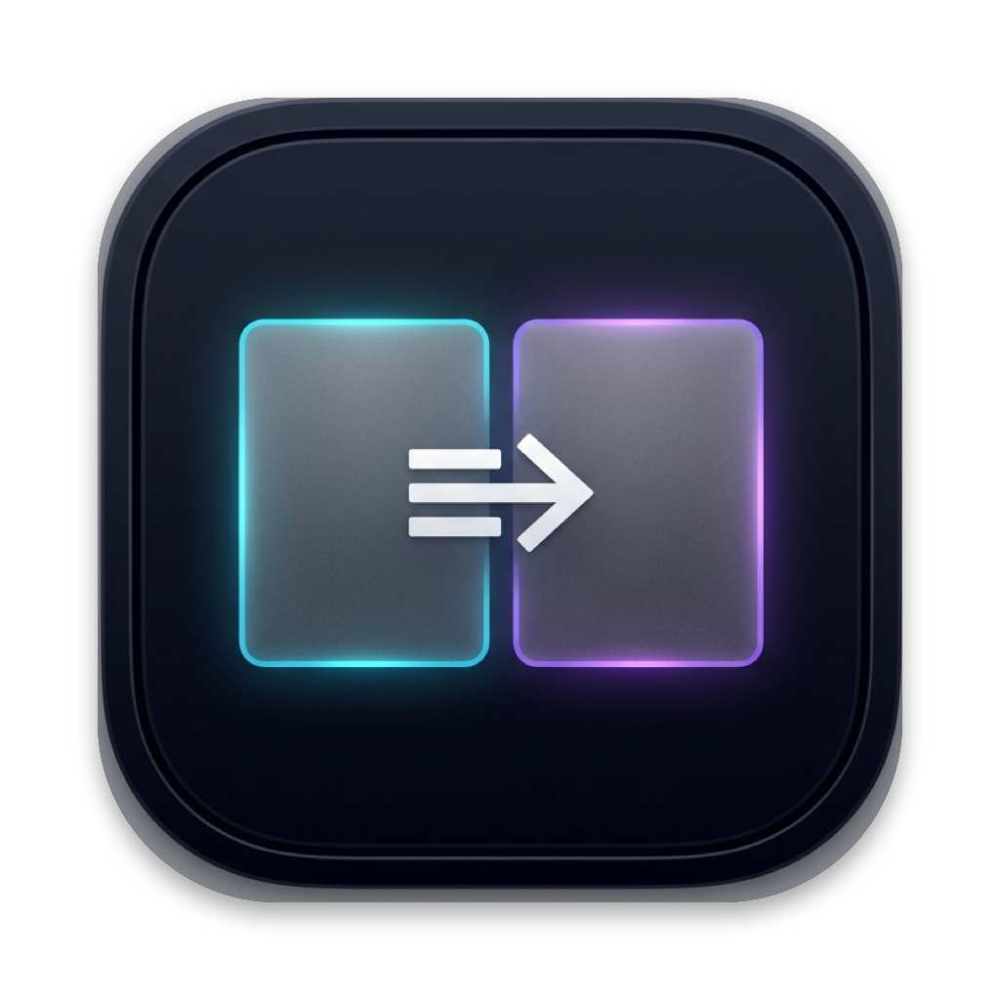
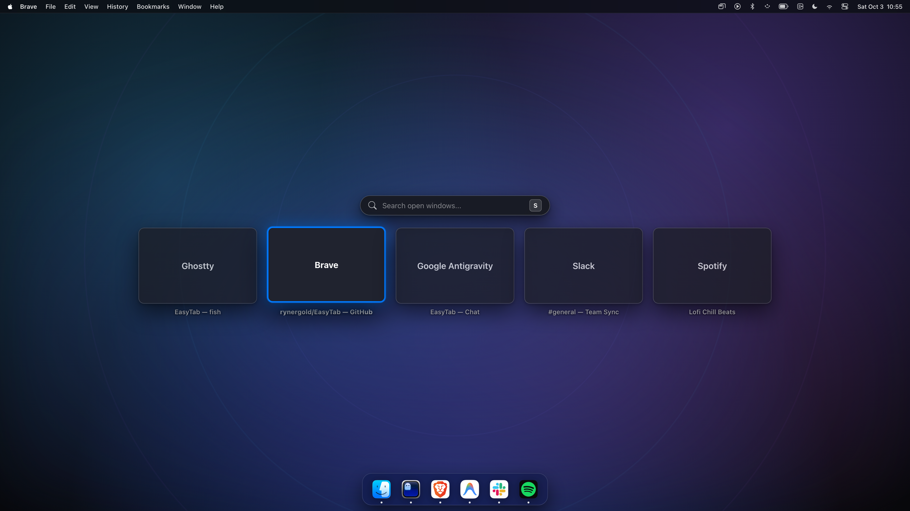

<div align="center">



# EasyTab

**Fast, lightweight Command+Tab window switcher for macOS.**

Default macOS `Cmd + Tab` only switches between **Applications**, not individual **Windows**.

[](https://github.com/rynergold/EasyTab/actions/workflows/ci.yml)
[](LICENSE)
[](https://github.com/rynergold/EasyTab/releases)
[](https://github.com/rynergold/EasyTab)
[](Casks/easytab.rb)

[Why EasyTab](#-why-easytab) · [Features & Controls](#-features--controls) · [Installation](#-installation) · [License](#-license--legal-notice)

<br><br>



</div>

---

## 💡 Why EasyTab?

* **True Alt-Tab on macOS**: Press `⌘ Cmd + Tab` to cycle through every open window across all apps and spaces in real-time Most-Recently-Used (MRU) order.
* **Insanely Lightweight**: Compiled pure Swift with native AppKit + SwiftUI. The entire app bundle is **< 300 KB** and uses **0.0% CPU** at idle.
* **Free forever**: I hate installing a QoL tool to be introduced to bloated irrelevant features, A SIGN IN 🤬😡🌋🤯, AND PAYING FOR SOMETHING SO SMALL LIKE THIS. IF YOU WANT MONEY, ASK FOR DONATIONS.


---

## ✨ Features & Controls

| Shortcut | Action |
| :--- | :--- |
| `⌘ Cmd + Tab` | Open switcher / cycle forward to next window (MRU order) |
| `Release ⌘ Cmd` | Instantly focus & raise selected window |
| `S` | Instant window search (filter by app name or window title) |
| `Enter` / `Release ⌘` | Confirm selected search result |
| `Esc` | Cancel switcher without changing window |


---

## 📦 Installation

### Option 1: Homebrew (Recommended)
```bash
brew install --cask rynergold/easytab/easytab
```
Or tap first:
```bash
brew tap rynergold/easytab
brew install --cask easytab
```

### Option 2: Direct Download (`.dmg`)
1. Download the latest **`EasyTab.dmg`** from [Public Releases](https://github.com/rynergold/homebrew-easytab/releases).
2. Open the `.dmg` and drag **EasyTab.app** into your **Applications** folder.

> **Note on Permissions**: macOS requires **Accessibility permission** for any app that intercepts global hotkeys and switches windows. On first launch, EasyTab will prompt you to enable it in **System Settings > Privacy & Security > Accessibility**. Because EasyTab is free software and not signed with a paid Apple Developer certificate, macOS Gatekeeper may show a warning on first launch. Simply **Right-Click > Open** (or run `xattr -d com.apple.quarantine /Applications/EasyTab.app`).


---

## 📄 License & Legal Notice

EasyTab is free software licensed under the **[EasyTab Freeware License](LICENSE)**.

> **Copyright (c) 2026 Ryner Gold. All rights reserved.**  
> *The Software is free to download and use for personal, educational, and commercial purposes. Reverse engineering, decompilation, redistribution of modified binaries or source code, and unauthorized commercial exploitation are strictly prohibited.*
